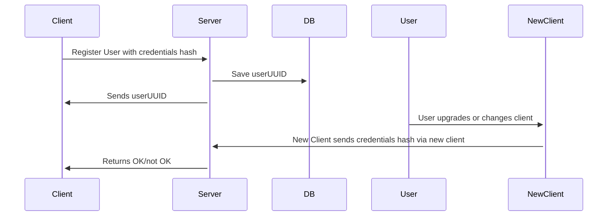
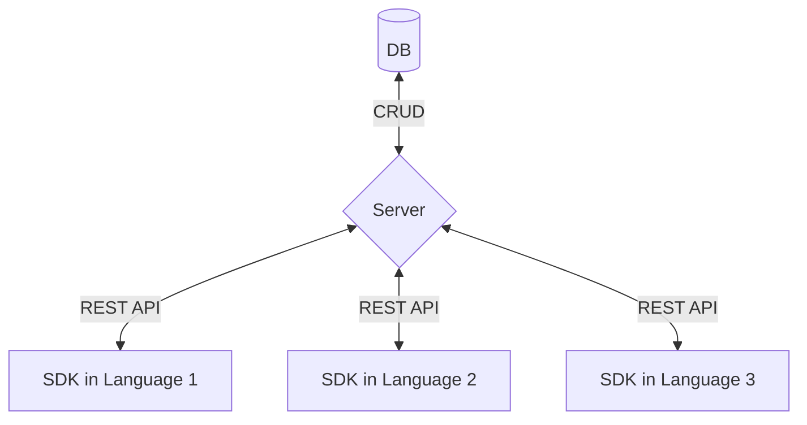

# Joan

*Joan* (Named for [Joan Clarke][joan] the codebreaker who joined Alan Turing during World War II) is a lightweight implementation of the [Sessionless][sessionless] authentication protocol, which allows implementers to save a hash of user credentials for providing account continuity.

## Overview

Joan is composed of a CRUD server and database pair, the latter of which defaults to the file system, and companion client-side libraries.
This repo defines the contract between client and server via REST API, provides database implementation(s) for storing the models used in that contract, and the methods necessary in a client implementation.

The typical usage will look something like:



And here's what the architecture looks like:



## API

It doesn't get much CRUDier than this API:

<details>
 <summary><code>PUT</code> <code><b>/user/create</b></code> <code>Creates a new user if pubKey does not exist, and returns existing uuid if it does and hash is correct.
signature message is: timestamp + userHash + appHash + pubKey</code></summary>

##### Parameters

> | name         |  required     | data type               | description                                                           |
> |--------------|-----------|-------------------------|-----------------------------------------------------------------------|
> | pubKey       |  true     | string (hex)            | the publicKey of the user's keypair  |
> | timestamp    |  true     | string                  | in a production system timestamps prevent replay attacks  |
> | userHash     |  true     | string                  | the credential hash to save for the user
> | appHash      |  true     | string                  | the application hash that the user is logging into
> | signature    |  true     | string (signature)      | the signature from sessionless for the message  |


##### Responses

> | http code     | content-type                      | response                                                            |
> |---------------|-----------------------------------|---------------------------------------------------------------------|
> | `200`         | `application/json`                | `{"userUUID": <uuid>}`   |
> | `400`         | `application/json`                | `{"code":"400","message":"Bad Request"}`                            |

##### Example cURL

> ```javascript
>  curl -X PUT -H "Content-Type: application/json" -d '{"pubKey": "key", "timestamp": "now", "userHash": "foo", "appHash": "bar", "signature": "sig"}' https://joan.planetnine.app/user/create
> ```

</details>

<details>
 <summary><code>GET</code> <code><b>/user/userHash/:userHash/appHash/:appHash?timestamp=<timestamp>&pubKey=<pubKey>&signature=<signature of (timestamp + userHash + appHash)></b></code> <code>Returns whether user credentials match what was saved</code></summary>

##### Parameters

> | name         |  required     | data type               | description                                                           |
> |--------------|-----------|-------------------------|-----------------------------------------------------------------------|
> | timestamp    |  true     | string                  | in a production system timestamps prevent replay attacks  |
> | pubKey       |  true     | string                  | the pubKey used for this request
> | userHash     |  true     | string                  | the credential hash to save for the user
> | appHash      |  true     | string                  | the application hash that the user is logging into
> | signature    |  true     | string (signature)      | the signature from sessionless for the message  |


##### Responses

> | http code     | content-type                      | response                                                            |
> |---------------|-----------------------------------|---------------------------------------------------------------------|
> | `200`         | `application/json`                | `{"userUUID": <uuid>}`   |
> | `406`         | `application/json`                | `{"code":"406","message":"Not acceptable"}`                            |

##### Example cURL

> ```javascript
>  curl -X GET -H "Content-Type: application/json" https://joan.planetnine.app/user/userHash/foo/appHash/bar?timestamp=123&pubKey=pubKey&signature=signature 
> ```

</details>

<details>
  <summary><code>PUT</code> <code><b>/user/:uuid/update-hash</b></code> <code>Updates an existing hash to a new hash.
signature message is:  timestamp + pubkey + userHash + newHash + appHash</code></summary>

##### Parameters

> | name         |  required     | data type               | description                                                           |
> |--------------|-----------|-------------------------|-----------------------------------------------------------------------|
> | timestamp    |  true     | string                  | in a production system timestamps prevent replay attacks  |
> | userUUID     |  true     | string                  | the user's uuid
> | userHash     |  true     | string                  | the old hash to replace
> | newHash      |  true     | string                  | the state hash saved client side
> | appHash      |  true     | string                  | the application hash that the user is logged into
> | signature    |  true     | string (signature)      | the signature from sessionless for the message  |


##### Responses

> | http code     | content-type                      | response                                                            |
> |---------------|-----------------------------------|---------------------------------------------------------------------|
> | `200`         | `application/json`                | `{"userUUID": <uuid>}`   |
> | `400`         | `application/json`                | `{"code":"400","message":"Bad Request"}`                            |

##### Example cURL

> ```javascript
>  curl -X POST -H "Content-Type: application/json" -d '{"timestamp": "right now", "userUUID": "uuid", "hash": "hash", "newHash": "newHash", "signature": "signature"}' https://joan.planetnine.app/user/update-hash
> ```

</details>

<details>
  <summary><code>DELETE</code> <code><b>/user/:userUUID/delete/appHash/:appHash</b></code> <code>Deletes a uuid and pubKey.
signature message is: timestamp + userUUID + appHash</code></summary>

##### Parameters

> | name         |  required     | data type               | description                                                           |
> |--------------|-----------|-------------------------|-----------------------------------------------------------------------|
> | timestamp    |  true     | string                  | in a production system timestamps prevent replay attacks  |
> | userUUID     |  true     | string                  | the user's uuid
> | appHash      |  true     | string                  | the application hash that the user is being deleted from
> | signature    |  true     | string (signature)      | the signature from sessionless for the message  |

##### Responses

> | http code     | content-type                      | response                                                            |
> |---------------|-----------------------------------|---------------------------------------------------------------------|
> | `202`         | `application/json`                | empty   |
> | `400`         | `application/json`                | `{"code":"400","message":"Bad Request"}`                            |

##### Example cURL

> ```javascript
>  curl -X DELETE https://joan.planetnine.app/user/123-456/delete/appHash/app
> ```

</details>

## Databases

One of the biggest benefits of Sessionless is that it doesn't need to store any sensitive data.
This means all of the data Joan cares about can all be saved in a single table/collection/whatever-other-construct-some-database-may-have.
And that table looks like:

| uuid  | pubKey | hash
:-------|:-------|:-----
 string | string | string

uuid, and pubKey should have unique constraints (Sessionless generated keys and uuids should not collide, but since this is a public API people may just reuse keys and uuids).

## Client SDKs

Client SDKs need to generate keys via Sessionless, and implement the networking to interface with the server. 
To do so they should implement the following methods:

`createUser(hash, saveKeys, getKeys)` - Should generate keys, save them appropriately client side, and PUT to /user/create.

`reenter(hash, saveKeys, getKeys)` - Should GET to check the saved hash on the client against the saved hash on the server via /user/:uuid/pubKey/:pubKey?timestamp=timestamp&hash=hash&signature=signature.

`updateHash(uuid, hash, newHash)` - Should POST the passed in hash to /user/:uuid/save-hash.

`deleteUser(uuid, hash)` - Should DELETE a user by calling /user/:uuid.


## Use cases

**NOTE** Joan is experimental, and the instance at planetnine.app is ephemeral, and may go away or reset at any time.
If you're making the next Palworld and want to use joan, you're advised to self-host it, or contact zach@planetnine.app to help him upgrade the micro instance it runs on :).

* You can use joan as straight auth for your backend instead of other auth providers.

* You can use joan for account continuity before using more intrusive auth layers, by utilizing other miniservices in the Planet Nine system.
I.e. instead of having potential players bounce off because of needing to enter their email/password before playing, you can auth with continuebee, and then ask for email/password when they hit level five after they've been hooked.

* Just use it as a practice backend before figuring out all the auth needs of your game/app. 

## Self-hosting

This is a bit dependent on what the server implementations are, so we'll fill the details in later, but the idea is that continuebee is hostable by others either for public use like the main instance, or private use.

## Contributing

To add to this repo, feel free to make a [pull request][pr].

[pr]: https://github.com/planet-nine-app/continuebee/pulls
[sessionless]: https://www.github.com/planet-nine-app/sessionless
[joan]: https://en.wikipedia.org/wiki/Joan_Clarke

